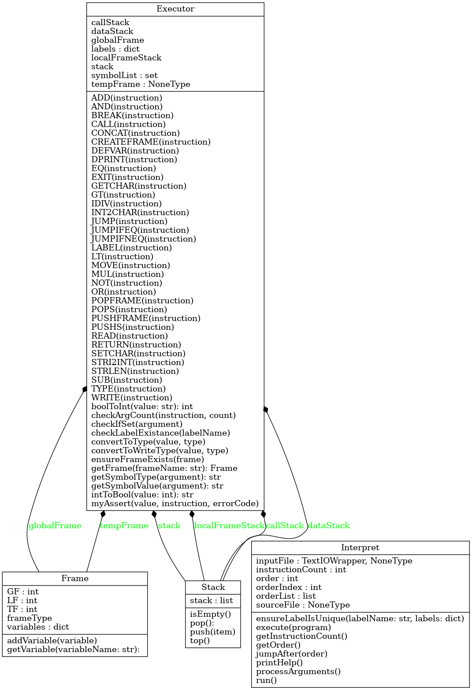
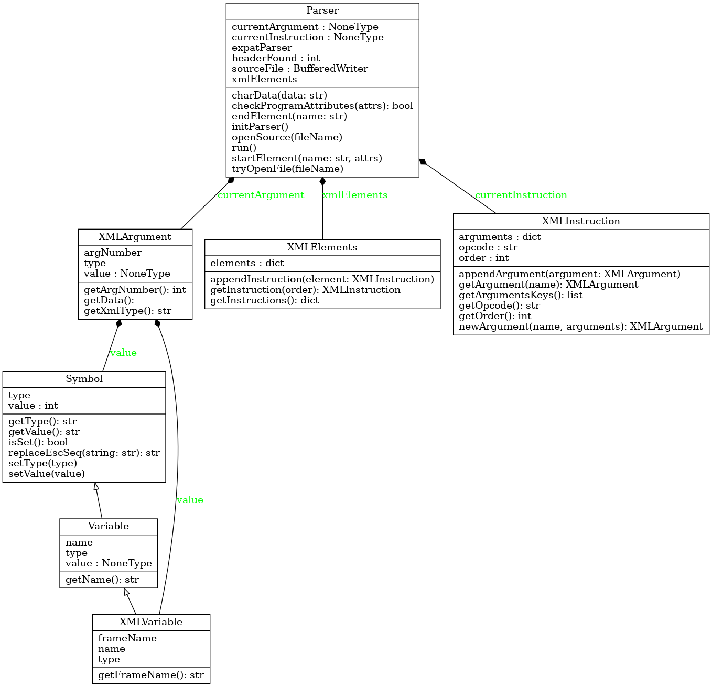

Implementační dokumentace k 2. úloze do IPP 2022/2023  
Jméno a příjmení: Jakub Mašek  
Login: xmasek19  
# Interpret IPPcode23 kódu
Interpret je napsán v jazyce Python 3.10 a zpracovává kód v IPPcode23.

## Struktura interpretu
Interpret je rozdělen do tří souborů:
  * interpret.py - hlavní soubor, metody pro zpracování argumentů a interpretace kódu
  * parse.py - soubor, který obsahuje metody pro zpracování a uložení kódu do datové struktury
  * error.py - soubor, který obsahuje výčet chybových kódů

### *interpret.py*
Je hlavní soubor interpretu, který obsahuje třídu `Interpret`, která obsahuje metody pro zpracování argumentů a interpretaci kódu. Dále obsahuje třídu `Frame`, která obsahuje metody pro práci s rámci a třídu `Stack`, která obsahuje metody pro práci se zásobníkem. Třída `Interpret` obsahuje také globální proměnné pro práci s rámci a datovým a zásobník volání.

#### Třída Interpret
Obsahuje metodu `run`, která zpracuje argumenty a vytváří objekt třídy Parser, který zpracuje kód a vytvoří datovou strukturu. Dále obsahuje metodu `execute`, která obsahuje smyčku, která prochází datovou strukturou a volá metody pro interpretaci jednotlivých instrukcí. Mimo to obsahuje metody pro řízení interpretace, například změna čísla instrukce, která se má vykonat. 

#### Třída Frame
Obsahuje třídní proměnné `GF`, `LF` a `TF`, které označují typy rámců. Funkcionalitu zajišťuje metoda pro uložení symbolu do rámce `addVariable`, metoda pro získání symbolu z rámce `getVariable`.

#### Třída Stack
Třída je generikum a zajišťuje práci se zásobíky. Obsahuje metody `push`, `pop`, `top` a `isEmpty`.

#### Třída Executor
Obsahuje metody pro interpretaci jednotlivých instrukcí. Metody jsou pojmenovány velkými písmeny podle instrukce, kterou interpretují. Navíc obsahuje metody pro zjednodušení práce s potřebnými daty.
Za zmínku stojí metody `getSymbolValue` a `getSymbolType`, které zajišťují získání hodnoty a typu symbolu, který může být proměnná nebo konstanta.
```python
def getSymbolValue(self, argument:parse.XMLArgument) -> str:
    if argument.getXmlType() == "var":
        # získání rámce v kterém je proměnná
        frame = self.getFrame(argument.getData().getFrameName())
        # získání proměnné
        var = frame.getVariable(argument.getData().getName())
        # získání hodnoty proměnné
        value = var.getValue()
        self.convertToType(value, var.getType())
        return value
    else:
        value = argument.getData().getValue()
        return self.convertToType(value, argument.getData().getType())
```
### Diagram tříd v *interpret.py*


### *parse.py*
Modul se stará o načtení XML kódu a zpracování instrukcí. Obsahuje třídu Parser, která veškeré zpracovávání řídí. Dále obsahuje třídy XMLElement, XMLInstruction, XMLArgument, Symbol, Variable a XMLVariable. Tyto třídy slouží pro uložení jednotlivých instrukcí a jejich argumentů do datové struktury.

#### Třída Parser
Metodou `run` se zpracuje XML kód a vytvoří datovou strukturu a vrací slovník s instrukcemi ve formátu `{order: instruction}`. Probíhá zde volání metod pro zpracování jednotlivých částí XML kódu.

#### Třída XMLElements
Obsahuje list všech zpracovaných XML elementů. Obsahuje metodu pro přidání instrukce, metodu pro získání instrukce podle pořadí a metodu pro listu všech instrukcí.

#### Třída XMLInstruction
Obsahuje atributy `order`, `opcode` a list argumentů `arguments`. Obsahuje metody pro editaci těchto atributů.

#### Třída XMLArgument
Obsahuje atributy `type`, `value` a `argNumber`, která značí pořadí argumentu v daném elementu. Obsahuje metody pro editaci těchto atributů.

#### Třída Symbol
Obsahuje atributy `type` a `value`. Obsahuje metody pro editaci těchto atributů.

#### Třída Variable
Dědí z třídy Symbol. Obsahuje navíc atribut `name` a metodu pro editaci tohoto atributu.

#### Třída XMLVariable
Dědí z třídy Variable. Obsahuje navíc atribut `frameName` a metodu pro editaci tohoto atributu.

### Diagram tříd v *parse.py*


### *error.py*
Obsahuje výčet chybových kódů, které se vypisují při chybě.